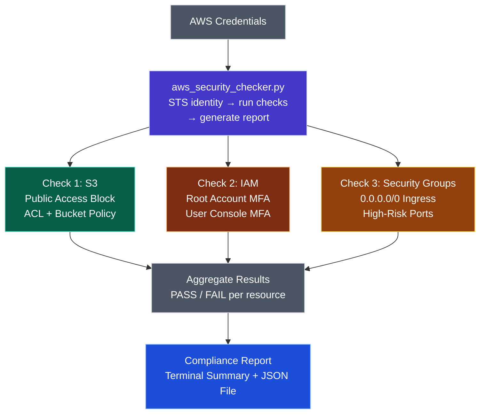

# AWS-Security-Compliance-Checker
A Python + boto3 CLI tool that automatically audits your AWS account for common security misconfigurations. Built as a hands-on Cloud Security portfolio project.


# 🔒 AWS Security Compliance Checker

A Python + boto3 CLI tool that automatically audits your AWS account for common security misconfigurations. Built as a hands-on Cloud Security portfolio project.


## What It Checks

The tool follows a simple audit workflow: it reads AWS credentials, verifies the current AWS identity, runs security checks across S3, IAM, and Security Groups, then aggregates the results into a compliance report.





| Check | Description | Severity |
|---|---|---|
| S3 Public Access | Checks S3 Public Access Block configuration, ACL grants, and wildcard bucket policies. | High |
| IAM MFA Enforcement | Checks whether the root account has MFA enabled and identifies console users without MFA devices. | Critical |
| Security Group Open Access | Detects inbound rules allowing `0.0.0.0/0` or `::/0` on high-risk ports. | High |


## Sample Output

```
╔══════════════════════════════════════════════════╗
║       AWS Security Compliance Checker            ║
╚══════════════════════════════════════════════════╝
  Authenticated
  Account:  123456789012

=======================================================
  CHECK 1: S3 Bucket Public Access
=======================================================
  Bucket: my-app-logs  →  ✅ PASS
  Bucket: public-site  →  ❌ FAIL
    • Bucket policy allows wildcard (*) principal

=======================================================
  COMPLIANCE SUMMARY REPORT
=======================================================
  Total Checks:  8
  Passed:        6
  Failed:        2
  Compliance:    75.0%
```

## Prerequisites

- **Python 3.8+**
- **AWS CLI** configured (`aws configure`) or environment variables set
- IAM permissions required (see below)

### Minimum IAM Policy

```json
{
  "Version": "2012-10-17",
  "Statement": [
    {
      "Effect": "Allow",
      "Action": [
        "s3:ListAllMyBuckets",
        "s3:GetBucketAcl",
        "s3:GetBucketPolicy",
        "s3:GetBucketPublicAccessBlock",
        "iam:GetAccountSummary",
        "iam:ListUsers",
        "iam:GetLoginProfile",
        "iam:ListMFADevices",
        "ec2:DescribeSecurityGroups",
        "sts:GetCallerIdentity"
      ],
      "Resource": "*"
    }
  ]
}
```

> 💡 **Tip:** Follow the principle of least privilege — use a read-only audit role.

## Quick Start

```bash
# Clone the repo
git clone https://github.com/YOUR_USERNAME/aws-security-compliance-checker.git
cd aws-security-compliance-checker

# Create virtual environment
python -m venv venv
source venv/bin/activate   # Windows: venv\Scripts\activate

# Install dependencies
pip install -r requirements.txt

# Run the checker
python aws_security_checker.py
```

## Project Structure

```
aws-security-compliance-checker/
├── aws_security_checker.py    # Main script — all checks and report logic
├── requirements.txt           # Python dependencies
├── .gitignore                 # Ignore venv, reports, credentials
├── LICENSE                    # MIT License
└── README.md                  # You are here
```

## JSON Report Output

Each run generates a timestamped JSON report:

```json
{
  "report_date": "2026-03-25T12:00:00Z",
  "summary": {
    "total_checks": 10,
    "passed": 7,
    "failed": 3,
    "compliance_score": 70.0
  },
  "results": [
    {
      "resource": "my-bucket",
      "check": "S3 Public Access",
      "status": "FAIL",
      "findings": ["Bucket policy allows wildcard (*) principal"]
    }
  ]
}
```

## Security Considerations

- This tool requires **read-only** access — it never modifies your AWS resources.
- Never commit AWS credentials to this repo.
- Run in a sandboxed / lab AWS account before using on production.

## Roadmap

- [ ] CloudTrail logging validation
- [ ] EBS volume encryption check
- [ ] RDS public accessibility check
- [ ] HTML report generation
- [ ] AWS Config rule comparison
- [ ] Multi-account support (AWS Organizations)

## Built With

- [Python 3](https://www.python.org/)
- [boto3](https://boto3.amazonaws.com/v1/documentation/api/latest/index.html) — AWS SDK for Python
- [CompTIA Security+](https://www.comptia.org/certifications/security) knowledge applied

## License

This project is licensed under the MIT License — see the [LICENSE](LICENSE) file.

## Author

**[Your Name]** — Cloud Security Engineer in training
- Certifications: CompTIA Security+, AWS SAA (in progress)
- GitHub: [@YOUR_USERNAME](https://github.com/YOUR_USERNAME)
